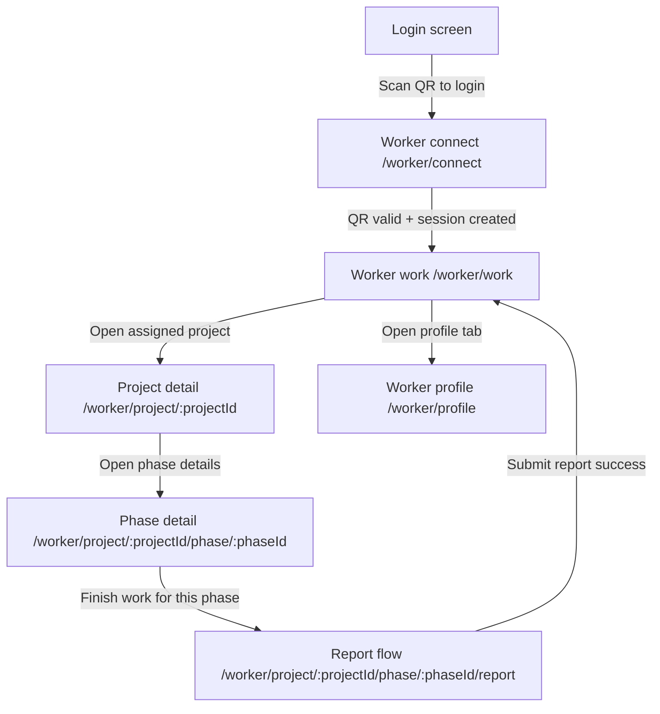

# EchipaMea

Mobile app for small contractor teams, built with Flutter.

## What it does

- Supports two roles: Foreman and Worker
- Foreman area includes:
  - Dashboard (employees, active projects, assignment visibility, "Today's worker sequence" overview with swipe-to-plan rows, a "Finished projects" KPI card with period filters: this month/last month/custom range, and a bottom embedded map section)
  - Getting started checklist for first-time foreman workflows (add client, create project, configure a phase, add employee), with local progress persisted via SharedPreferences and a detailed checklist screen at `/foreman/getting-started`
  - Map (active projects in progress and worker positions in one live overview)
  - Projects (list, add, edit, status, and required client assignment). List rows support horizontal swipe for quick actions (for example edit vs open the Phases tab on an existing project). On a project’s **Phases** tab, swipe a phase row horizontally to open the same edit flow as the edit icon (draft phases use the quick dialog; saved projects use the full-screen phase form). Each phase has a required date window (`From`/`To`) and assigned members, plus a local "Work sequence for day" planner that auto-suggests per-worker phase order from date windows and supports drag-and-drop/manual reordering and reset-to-auto for a selected day. The project-level worker summary is derived automatically from phase assignments (no separate manual workers input). Each **phase** can include **work instructions** for assigned workers: an ordered list of steps, where **each step** can have its own reference photos (gallery) and **voice memos** (same recording approach as the worker report flow). Attachments are stored as local paths in the in-memory demo until a backend stores binaries.
  - Team (list, add, edit, contact data: phone/email, trade role chosen from a predefined list in a dropdown, employee QR login generation)
  - Clients (list, add, edit, contact data: phone/email/split address fields/person of contact, plus client type/status/preferred contact method/notes and allocated projects per client, including a dedicated client-projects list page with direct "Add project" for that client)
  - Profile (change app language and theme mode: Follow system/Light/Dark, edit personal data, manage foreman company data: name/address/IBAN/CUI/VAT/trade register number, and logout)
  - Phone fields on team, clients, and profile use `intl_phone_number_input`: country code is chosen from a short list (Romania +40 first), and the national number is formatted as you type.
  - Realtime notifications badge in the app bar for new worker report submissions (via websocket events from backend)
- Worker area (fewer screens than foreman: work + profile):
  - **Work** (`/worker/work`): queue of jobs assigned to you. Projects store optional roster employee IDs (resolved from worker names when the foreman saves the project); assignment matches signed-in **employee ID** when those IDs are set, and otherwise falls back to your display name on the worker list. The next job is highlighted; tap for details. Each project card also shows a compact weather widget based on project coordinates.
  - **Job details** (`/worker/project/:id`): **Open navigation** lists installed map apps (Google Maps, Apple Maps, Waze, etc.) via `map_launcher` and starts directions to the site; falls back to Google Maps in the browser if none are detected. Requires coordinates on the project. Assigned **phases** show each instruction step in its own card with thumbnails and play/stop for that step’s voice notes where the platform supports it (voice playback is skipped on web with an on-screen hint), and each phase can be opened in a dedicated phase detail page (`/worker/project/:id/phase/:phaseId`).
  - **Report** (`/worker/project/:id/phase/:phaseId/report`): report is now linked to a specific phase and should be submitted from the phase the worker worked on that day. The flow has three steps—optional site photos (up to 8) from gallery or camera capture, tappable photo thumbnails with enlarged preview, optional voice memo with replay/remove before submit, and required short description; then submit to backend with multipart/form-data including phase identifiers. The worker queue drops the job immediately after a successful submit; when a `worker_report_submitted` event is received on `FOREMAN_NOTIFICATIONS_WS_URL`, the relevant phase transitions to **Pending review** in the foreman flow. The overall project becomes **Done** only after all phases are approved (local demo stays consistent when that websocket is wired up).
  - **Profile** (`/worker/profile`): app language and worker logout.
- Worker login flow:
  - Foreman generates a short-lived worker login QR ticket from Team
  - Worker scans that QR ticket (no worker credentials required)
  - After a successful scan, the app opens the worker **Work** tab
  - Worker phone streams location to backend via WebSocket only during configured working hours
- Localization:
  - English, Romanian, Hungarian (default on first launch: Romanian)
  - Runtime language switch from the app
- Legal:
  - Terms and Conditions page

## Foreman planning flow

1. Create or edit a project and open the **Phases** tab.
2. Add phases with required `From`/`To` dates and assign team members per phase.
3. Use **Work sequence for day** to pick a day and organize each worker's phase order (auto suggestion or manual drag/reorder).
4. Save phase/project updates; project-level worker summary is derived automatically from phase assignments.
5. Open **Dashboard** to review:
  - **Today's worker sequence** (including swipe-to-plan shortcut)
  - **Finished projects** card with period filter (`This month`, `Last month`, `Custom`)
  - Map section for project and worker location context

## Tech stack

- Flutter
- Riverpod (state management)
- GoRouter (navigation)
- `mobile_scanner` (QR scanning)
- `qr_flutter` (QR generation)
- `flutter_map` + OpenStreetMap tiles (foreman map view)
- `geolocator` (worker GPS location)
- `web_socket_channel` (worker telemetry to backend)
- `url_launcher` (fallback open in browser when no map app is available)
- `map_launcher` (pick installed navigation app: Google Maps, Apple Maps, Waze, …)
- `image_picker` (optional photos on worker report: gallery + camera capture)
- `record` (optional voice memo on worker report and foreman phase instructions)
- `audioplayers` (play foreman instruction voice notes and worker report memos)
- `path_provider` (temp file path for recordings)
- `flutter_localizations` (i18n)
- `intl_phone_number_input` (international phone entry with country selector and masking)

## Worker telemetry configuration

Add these variables to `.env` for worker location streaming:

- `WORKER_TELEMETRY_WS_URL` = backend WebSocket endpoint (`ws://` or `wss://`)
- `WORKER_REPORTS_API_URL` = backend HTTP endpoint for report submit (example: `https://api.example.com/worker/reports`)
- `FOREMAN_NOTIFICATIONS_WS_URL` = backend WebSocket endpoint used after successful report upload to publish a `worker_report_submitted` event (example: `wss://api.example.com/ws/foreman-notifications`)

Behavior:

- Each employee has configurable working days and start/end hour.
- Location events are sent only while local device time is inside that employee's configured schedule.
- While in schedule, the app sends the worker's current position about **every 30 minutes** on the same WebSocket (`type`: `worker_location`, same JSON shape as before). The first send runs shortly after the session becomes active in working hours.
- Outside working hours, the app does not send telemetry and closes the WebSocket connection.
- When a worker report upload succeeds, the app opens a short-lived websocket, waits until the socket is **ready**, sends one `worker_report_submitted` JSON payload, then **closes the sink** (awaited) so the frame can flush before teardown—still best-effort if the server or network drops the connection.

## Worker flow diagram (QA)

## Worker report permissions (mobile)

- **Android**: `RECORD_AUDIO` is declared for voice memos; the photo picker uses the system photo picker where available. `map_launcher` merges package visibility queries for common map apps.
- **iOS**: `Info.plist` includes microphone, photo library, and camera usage strings for reports (camera capture is used directly in the worker report flow). `LSApplicationQueriesSchemes` includes URL schemes so the app can detect and open third-party map apps (see `map_launcher` docs for the full list).

## Run the app

1. Install Flutter SDK and platform tooling.
2. From the project root, install dependencies:
  - `flutter pub get`
3. Run on a selected target:
  - Windows desktop: `flutter run -d windows`
  - Chrome web: `flutter run -d chrome`
  - Android device/emulator: `flutter run -d <device-id>`

Check available targets with:

- `flutter devices`

## Authentication during development

- If `AUTH_API_BASE_URL` is not set, foreman login runs in mock mode.
- In mock mode, any valid-looking email (contains `@`) and password with at least 3 characters will log in.
- Worker login uses local mock delegated tickets (no API call yet):
  - Foreman QR contains `type=foreman_worker_login_ticket`, `ticketId`, worker identity, and `expiresAt`.
  - Worker scan accepts only non-expired tickets and creates a mock worker session token in memory.
  - This mirrors the planned backend consume-ticket flow, but all validation is local for now.

## Build

- Android APK (release): `flutter build apk`

## Project structure (high level)

- `lib/src/core/`
  - routing, localization, role/session foundations
- `lib/src/features/home/`
  - role selection + language switch entry
- `lib/src/features/foreman/`
  - dashboard, projects, team, clients, form pages
- `lib/src/features/worker/`
  - worker QR connect page, work shell (work + profile), job detail, report wizard, assignment and foreman-inbox state (in-memory demo)
- `lib/src/features/legal/`
  - terms page

